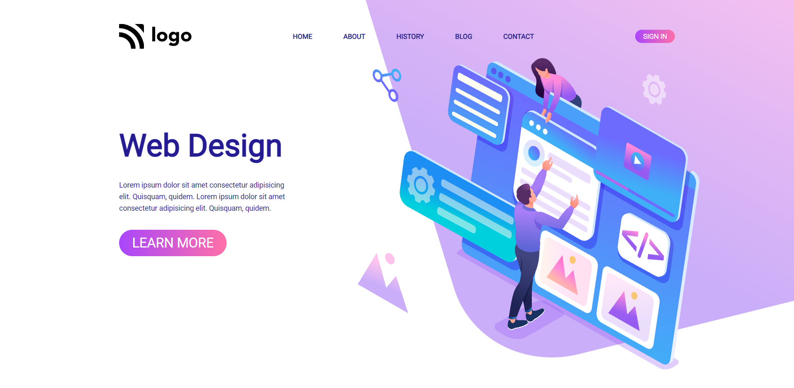

# Web Design Landing Page

> Project 8

<table>
<tr>
<td>
  A landing page designed using pure HTML & CSS.
</td>
</tr>
</table>

### Skills Gained from this

- Navbar using CSS flexbox.
- Elements positioning using CSS float, position(fixed) property.
- Class, attribute selector for HTML elements.
- Adding background image with background-repeat, background-position, and background-size property.
- Adding background color to button using linear-gradient property.
- Media queries to make responsive in all devices.

### Screenshot

## Device support

This webpage is compatible with desktop/tablet/mobile screens, and consistent improvements are being made.

## Author

### Bug / Feature Request

If you find a bug or to request a new feature, kindly open an issue [here](https://github.com/Shashanka8/Project-8-Design-Landing-Page/issues/new).
